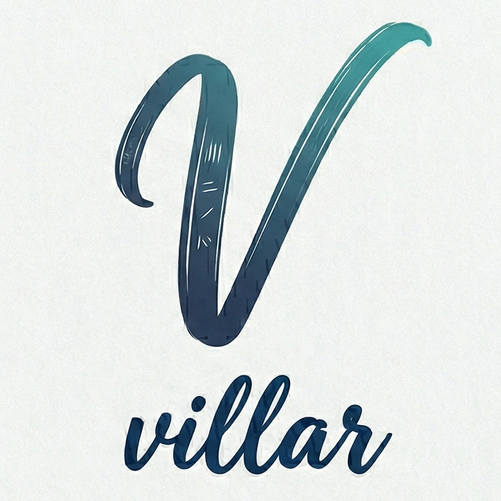

<p align="center">
  
</p>

<h1 align="center">villar</h1>

<p align="center">AI-generated Markdown reader. Restructures long md files into a card-based reading experience.</p>

## Features

### Reading Experience
- **H2 Card View** - Splits documents by H2 headings into navigable cards
- **Focus Mode** - Dims inactive cards (configurable opacity, toggle with F)
- **TL;DR Cards** - Auto-generated summaries per section (rule-based + TextRank for longer content)
- **Reading Progress** - Scroll-based progress bar + section read marks
- **Card Thumbnails** - Mini-cards in footer for quick section navigation
- **File Dates** - Created/Updated timestamps displayed per file
- **H1/H2/H3 Outline** - Sidebar outline with click-to-navigate

### Markdown Support
- **GFM** - Tables, task lists, strikethrough, autolinks
- **Mermaid** - Linear flowchart step UI + mermaid.js diagram fallback + raw text fallback
- **Code Highlight** - Syntax highlighting with copy button
- **Auto Collapse** - Long lists (>5 items) and code blocks (>20 lines) folded by default
- **Image Preview** - Local images resolved and displayed

### File Management
- **Folder Tree** - Hierarchical file/folder sidebar with live updates
- **Multi-Tab** - Open multiple files with drag-and-drop reordering and context menu
- **Full-Text Search** - Cmd+K to search across all files
- **In-Document Search** - Cmd+F to find within current document
- **Drag & Drop** - Drop files or folders to open
- **Session Restore** - Reopens last folder and files on launch
- **File Watcher** - Live reload when source files change externally

### Customization
- **46 Color Themes** - Dracula, Nord, Tokyo Night, Catppuccin, Gruvbox, Material, Night Owl, Vitesse, and more
- **46 Font Families** - Sans-serif, serif, and monospace options including CJK fonts
- **Font Scale** - 50%-150% zoom for content area (Cmd+=/-, Cmd+0 to reset)
- **Line Height** - 100%-250% adjustable
- **Content Width** - Narrow, medium, or wide layout
- **10 Languages** - English, Japanese, Chinese (Simplified/Traditional), Korean, Spanish, German, Vietnamese, Malay, Arabic
- **Settings Sidebar** - All options accessible via Cmd+, or gear icon

### Window
- **Custom Menu Bar** - Native Tauri menu with themed overlay title bar
- **Resizable Sidebars** - Drag to resize file tree and settings panel
- **Diff Indicators** - Changed sections highlighted on external file update
- **New Window** - Cmd+Shift+N to open a new instance

## Design Principles

- **Read-only** - Source files are never modified
- **Local-only** - No external network requests
- **Fallback-first** - When conversion fails, show original content

## Tech Stack

| Layer | Choice |
|---|---|
| Desktop | Tauri v2 (Rust backend) |
| Frontend | React 19 + TypeScript |
| Markdown | remark + rehype + remark-gfm (custom plugins) |
| Mermaid | mermaid.js (dynamic import + LRU cache) |
| Styling | Tailwind CSS v4 |
| State | Zustand (slice pattern) |
| Unit Tests | Vitest (96 tests) |
| E2E Tests | Playwright (51 tests) |

## Getting Started

```bash
# Install dependencies
npm install

# Run in development mode
npm run tauri dev

# Run unit tests
npm test

# Type check
npm run typecheck

# Run E2E tests (needs dev server running)
npm run test:e2e

# Production build
npm run tauri build
```

### Prerequisites

- Node.js >= 20
- Rust toolchain (stable)
- macOS / Windows / Linux

## Keyboard Shortcuts

| Key | Action |
|---|---|
| `Arrow Left/Right` | Navigate between cards |
| `Home` / `End` | Jump to first/last card |
| `F` | Toggle focus mode |
| `Cmd+K` | Full-text search |
| `Cmd+F` | Find in document |
| `Cmd+W` | Close tab |
| `Cmd+,` | Open settings |
| `Cmd+=` / `Cmd+-` | Zoom in / out |
| `Cmd+0` | Reset zoom |
| `Cmd+Shift+N` | New window |

## Project Structure

```
src/
  components/
    CardView/       # Card display, TL;DR, Mermaid, SectionContent, FileMeta
    Header/         # Themed header with native menu
    Sidebar/        # File tree + outline
    TabBar/         # Multi-tab with drag reordering
    FindBar/        # In-document search
    Search/         # Full-text search modal
    Settings/       # Settings right sidebar
  hooks/            # useMarkdown, useTheme, useKeyboard, useFileWatcher, useMenuActions, etc.
  plugins/          # Custom remark/rehype plugins
    remark-section.ts   # H2-based document splitting
    remark-tldr.ts      # TL;DR extraction (rule-based + TextRank)
    remark-collapse.ts  # Auto-collapse with React markers
    mermaid-linear.ts   # Linear flowchart detection
    textrank.ts         # TextRank sentence ranking
  stores/           # Zustand state management
    useAppStore.ts      # Main store (UI state)
    settingsSlice.ts    # Settings + persistence
    tabSlice.ts         # Tab operations + session
  i18n/             # Internationalization
    locales/            # 10 language files
    translations.ts     # Translation key types
    useTranslation.ts   # Translation hook
  themes/           # 46 color themes + 46 font presets
src-tauri/
  src/lib.rs        # Rust commands (file tree, watcher, search, logging)
e2e/                # Playwright E2E tests with Tauri API mocking
docs/
  mvp.md            # MVP specification
  v2concept.md      # V2 implementation guide
```

## License

[MIT](LICENSE)
